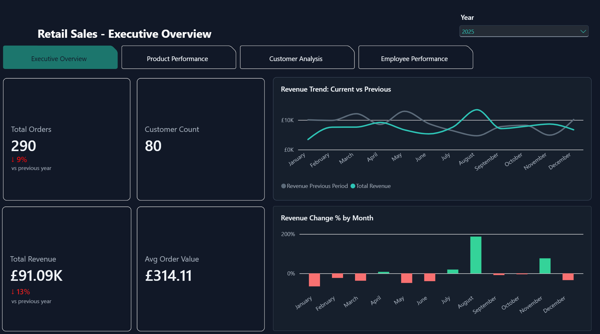
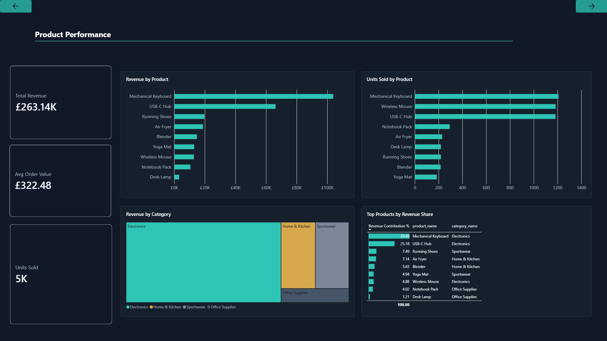
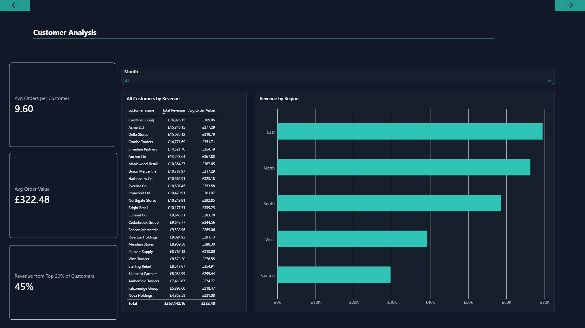
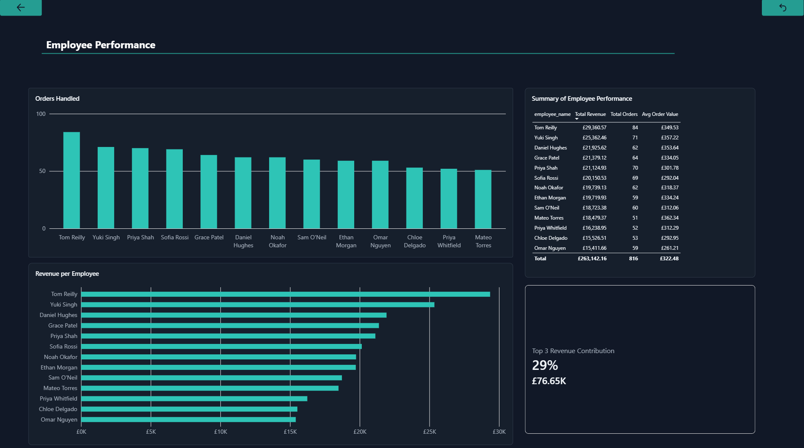

# Retail Sales Dashboard

## Overview
An interactive, four-page Power BI dashboard designed to analyse business performance across customers, employees and products. The dashboard includes dynamic DAX measures and visuals that respond to filters according to user selections, highlighting yearly comparisons, tracking revenue and other KPIs.

## Background
Databases house large volumes of vital business data that are difficult to interpret in their raw form, requiring manipulation. This project converts the retail sales data into a cohesive dashboard, interactively responding to user selections to display analysis of business performance.

## Features
-	Instant calculation of key business KPIs.
-	Year and month slicers for interactive filtering.
-	Dynamic DAX measures that update automatically based on user’s filters.
-	Four report pages covering executive insights, customers, employees and product performance.
-	Supporting tables that complement charts/KPIs.
-	Year-over-year comparative charts.
  
## Technologies Used
- Microsoft Power BI
- DAX
-	PostgreSQL/SQL
  
## Requirements
- Microsoft Power BI (Desktop Version)

## How to Use

1.	Open the dashboard in Microsoft Power BI.
2.	Navigate between the Executive Overview, Product Performance, Customer Analysis and Employee Performance pages.
3.	Use the month/year slicers or manually interact with report visuals to filter the data.
4.	 KPIs, measures and visualisations automatically update based on the selected filters.

## Dashboard Contents

Executive Overview:
A high-level overview displaying revenue, average order value (AOV), customers, orders and year-over-year comparisons.
Product Performance:
A closer look at products contribution to revenue, units sold and AOV.
Customer Analysis:
Targeted customer KPIs complemented by regional revenue, all able to be filtered by month.
Employee Performance:
A high-level view of the revenue and orders per employee supported by a detailed summary table.

## Screenshots

### Executive Overview

### Product Performance

 

### Customer Analysis

### Employee Performance

